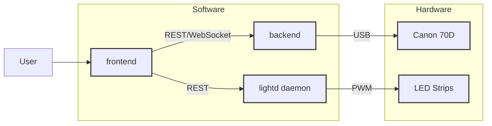

---
# You can also start simply with 'default'
theme: ./theme
title: Photobooth
info: Slides about my Wedding Photobooth
# apply unocss classes to the current slide
# https://sli.dev/features/drawing
drawings:
  persist: false
# enable MDC Syntax: https://sli.dev/features/mdc
mdc: true
layout: intro-image
image: /photobooth-1.jpg
dim: true
fonts:
  sans: Robot
  serif: Robot Slab
  mono: Fira Code
---

<div class="absolute top-10">
  <span class="font-700">
    Denys Vitali, 2025-04-02
  </span>
</div>

<div class="absolute bottom-10">
  <h1>Photobooth</h1>
  <p>A Go-based photo booth software</p>
</div>

---
layout: about
size: cover
position: left
---

# `whoami`

<style>
.os-logo {
  display: inline-block;
  height: 1.5em;
  padding: 0.2em 0.5em;
  vertical-align: middle;
  background-color: #fff;
  border-radius: 0.25em;
  margin-left: 0.25em;
}
</style>

- Denys Vitali

- Senior Platform O11y Engineer @ 

- [@denysvitali](https://github.com/denysvitali) on GitHub

- [denv.it](https://denv.it) and [blog.denv.it](https://blog.denv.it)

---
layout: statement
---

These slides are available at:  
[photobooth.slides.denv.it](https://photobooth.slides.denv.it)

<small>(and the source code is on https://github.com/denysvitali/photobooth-slides)</small>

---
layout: image-right-fh
image: /barry-wong-photobooth.jpg
---

# Photo booth

What is a photo booth?

<v-click>

> A photo booth is a vending machine or modern kiosk that contains an automated, usually coin-operated, camera and film processor. 
> Today, the vast majority of photo booths are digital. - [Wikipedia](https://en.wikipedia.org/wiki/Photo_booth)

</v-click>


---
layout: bullets
---

# Why?

- It's fun

- It's a great way to capture lots of memories
- It's a great way to entertain guests


---
layout: quote
---

# Okay, but... why?


---
layout: image
image: /wedding.jpg
---

---
layout: image
image: /photobooth-example-photo.jpg
---

<style>
  p.small-note {
    position: absolute;
    bottom: 0;
    right: 30px;
    text-align: right;
    font-size: 0.8em;
    text-shadow: 0 0 5px #000;
    
  }
</style>

<p class="small-note">
* "Hide the pain Harold" was not invited to my wedding
</p>

---
layout: image-right-fh
image: /photobooth-prices.png
---

# Your options

There are basically two options when it comes to getting a photo booth for your party:

- Rent a photo booth
  - Quite expensive
  - Not fun

- Build a photo booth
  - Relatively cheap (w/o labor & camera)
  - Yours forever


<small>Photo booth prices from thehappybooth.ch, not affiliated</small>


---
layout: image-right-fh
image: /photobooth-flutter-io.png
---

# DIY photo booth projects


Some projects already available:

- [PhotoboothProject/photobooth](https://github.com/PhotoboothProject/photobooth) <v-click>(PHP)</v-click>

- [Flutter I/O's Photo Booth](https://medium.com/flutter/how-its-made-i-o-photo-booth-3b8355d35883) <span v-click>(Flutter, duh)</span>

- [reuterbal/photobooth](https://github.com/reuterbal/photobooth) <span v-click>(Python)</span>

- [zoroloco/boothy](https://github.com/zoroloco/boothy) <span v-after>(Python)</span>


---
layout: bullets
---

# Why building one from scratch?

<style>
li + li {
  margin-top: 10px;
}

h3 + ul {
  margin-top: 20px;
}
</style>

All the previously mentioned projects are either:

<v-clicks every="1">

- Somewhat outdated
- Ugly

</v-clicks>

<v-clicks>

### On top of that...

</v-clicks>

<v-clicks>

- None of them are written in Go
- I'm a bit of a masochist
- I tend to overengineer things 😇

</v-clicks>

---
layout: section
---

<style>
img.go-logo {
  display: inline-block;
  height: 1.5em;
  vertical-align: middle;
}
</style>

# Building a Photo booth in 


---


# Architecture diagram

<br/>


<br/>


<v-clicks>
... looks relatively simple right?
</v-clicks>

---
layout: image-right-fh
image: /canon-eos-70d.jpg
---

# Hardware / BOM

<style>
.slidev-layout h1 {
  margin-bottom: 0.5rem;
}
table {
  font-size: 0.8em;
}

th {
  font-weight: bold;
}

td {
  padding: 8px;
}

small {
  font-size: 0.6em;
}
</style>

| Component | Price |
| --------- | ----: |
| Raspberry Pi 4 | ~ 60 CHF |
| SD Card (128 GB) | ~ 18 CHF |
| Canon EOS 70D | (~ 350 CHF)  |
| Camera Power Adapter | ~ 30 CHF |
| LED Strips + Power Supply | 30 CHF |
| [Touch Screen 15.6"](https://aliexpress.com/item/1005007092006430.html) | 83 CHF |
| [Shelf (Hyllis)](https://www.ikea.com/ch/en/p/hyllis-shelving-unit-in-outdoor-00278578/) | 19.95 CHF | 
| Decoration | 5 CHF |
| **Total** | **~ 240.95 CHF** |


<small>Prices from digitec.ch, Ricardo.ch, Aliexpress and IKEA. I'm not affiliated with any of them.</small>

<!--
  I'm not considering the cost of the camera in the calculation because:
  - I already had it
  - When the kiosk is not in use, it can be used for other purposes
  - The price range is huge - you can get a camera for 50 CHF or 5000 CHF
-->


---
layout: image-right-fh
image: /hyllis.jpg
size: contain
---

# Physical Structure

- [IKEA Hyllis shelving unit](https://www.ikea.com/ch/en/p/hyllis-shelving-unit-in-outdoor-00278578/)


<div class="shelf-diagram">
  <table>
    <tbody>
      <tr>
        <td class="level">Level 4 (Top)</td>
        <td class="item">
          <div class="icon">📷</div>
          <div class="label">Camera</div>
        </td>
      </tr>
      <tr>
        <td class="level">Level 3</td>
        <td class="item">
          <div class="icon">🖵</div>
          <div class="label">Touch Screen</div>
        </td>
      </tr>
      <tr>
        <td class="level">Level 2</td>
        <td class="item">
          <div class="icon">🖥️</div>
          <div class="label">Raspberry Pi 4</div>
        </td>
      </tr>
      <tr>
        <td class="level">Level 1</td>
        <td class="item">
          <div class="icon">🔌</div>
          <div class="label">Power</div>
        </td>
      </tr>
    </tbody>
  </table>
</div>

<style>
.shelf-diagram {
  margin: 0;
}
.shelf-diagram table {
  width: 100%;
  border-collapse: collapse;
}
.shelf-diagram tr {
  border-bottom: 1px dashed #999;
}
.shelf-diagram tr:last-child {
  border-bottom: none;
}
.shelf-diagram td {
  padding: 3px;
  vertical-align: middle;
}
.shelf-diagram .level {
  width: 130px;
  font-weight: bold;
  font-size: 0.9em;
}
.shelf-diagram .icon {
  font-size: 1.5em;
  margin-bottom: 2px;
  text-align: center;
}
.shelf-diagram .label {
  text-align: center;
  font-size: 0.85em;
}
</style>

<small>Not affiliated with IKEA. This thing was just crazy cheap, lightweight and perfect for my use case.</small>

---
layout: image
image: real-build-top.jpg
size: cover
---


---
layout: image
image: real-build-bottom.jpg
size: cover
---

---
layout: image-right-fh
image: /structure-final.jpg
size: contain
---

# Final result

<v-clicks depth="2">

- Poor man's cover

- Easy to transport
- Cover also helps with light diffusion
- Cables are somewhat hidden
- It gets the job done

</v-clicks>


<v-clicks>

### Additionally 

- The photo booth power in the back had a few spare USB plugs => guests can charge their phones

</v-clicks>


---
layout: image-right
image: /dummy-battery.jpg
size: contain
---

# Camera Setup

<v-clicks every="1">

- You can use _any camera_ [supported by gPhoto / libgphoto2](http://gphoto.org/proj/libgphoto2/support.php).

- You should buy a "Dummy Battery" to avoid running out of power

- Choose a good camera: the camera quality is proportional to the quality of the photos

</v-clicks>

<p v-click>
... but
</p>

---
layout: image-center
image: /eu-law-camcorders.png
---

---

# Why is this important?


For tax reasons, any commercial "camera" comes with the following:

<v-clicks every="1">

- Recording time is limited to 29 minutes and 59 seconds

- You cannot show the preview screen to the user for more than this time

- (You can't use it as a webcam for more than 30 minutes)

</v-clicks>

---
layout: fact
---

## Ironically this law doesn't exist anymore...

---
layout: fact
---

## ...but camera manufacturers still introduce / keep this dummy limitation


---

# Trick

To solve the issue:

<v-clicks every="1">

- We ask for a "camera preview" frame

- We send this frame to the frontend

- We ask for the next frame

</v-clicks>
<br/>
<p v-click>
Surprisingly, this works relatively well.
</p>
<p v-click>
... we'll get into the details about this later.
</p>

---
layout: image-right-fh
image: /xiaomi-portable-printer.jpg
size: contain
---

# Printer

<v-clicks every="1">

- BLE printer

- ~30 CHF

- Reverse engineered parts of it

- Eventually got somewhere, but couldn't get it to work in time

- Needless to say, this was not implemented

</v-clicks>

<br/>

<v-click>
<p>
  This part alone could be another (rather long) presentation 🚀
</p>
</v-click>


---
layout: image-right-fh
image: /photobooth-lights.jpg
size: contain
---

# LEDs

## Main purpose(s)

<v-clicks every="1">

- Used for ambient light

- Attracting people to the booth

</v-clicks>

---
layout: bullets
---

# Controlling brightness

<v-clicks>

- Controlled by [`lightd`](https://github.com/denysvitali/lightd/tree/master)

- Pulse Width Modulation (PWM)

- Ever wondered why LED lights are flickering when you take a picture?

</v-clicks>

---

# `lightd`

A stupid simple "daemon" to control the brightness of the LED strips

```go{|4}
func main() {
  arg.MustParse(&args)
  e := gin.Default()
  e.POST("/api/v1/set", setLight)
  if err := e.Run(args.ListenAddr); err != nil {
    logger.Fatalf("error starting server: %v", err)
  }
}
```

<v-clicks>

- Used directly by the frontend and by some boot scripts.

- Runs as root 😨 (we'll get to this later)

</v-clicks>

---

# PWM

<style>
.demo-container {
  position: absolute;
  top: 0;
  bottom: 0;
  left: 0;
  right: 0;
  margin: 0 auto;
  display: flex;
  justify-content: center;
  align-items: center;
  vertical-align: middle;
}
</style>

<div class="demo-container">
<PWMDemo/>
</div>

---

# PWM Basics

```go {1|2|3|5|6-9|11-14}
dutyCycle := 0.5 // 50% duty cycle
frequency := 100 // 100Hz
periodMs := 1000 / frequency

for {
  // Turn on the light
  gpio.High()
  onTimeMs := int(float64(periodMs) * dutyCycle)
  time.Sleep(time.Millisecond * time.Duration(onTimeMs))
  
  // Turn off the light
  gpio.Low()
  offTimeMs := periodMs - onTimeMs
  time.Sleep(time.Millisecond * time.Duration(offTimeMs))
}
```

---
layout: fact
---

## Extremely slow to do this in software!

---
layout: bullets
---

# PWM Controller

Can be easily used via [stianeikeland/go-rpio](https://github.com/stianeikeland/go-rpio/)

```go
// setBrightness sets the brightness of the LED strip (0-32)
func setBrightness(brightness int) error {
	if err := rpio.Open(); err != nil {
		return fmt.Errorf("error opening GPIO: %v", err)
	}
	defer rpio.Close()

	pin := rpio.Pin(args.GpioPin)
	pin.Mode(rpio.Pwm)
	pin.Freq(64000)
	pin.DutyCycle(uint32(brightness), 32)
	return nil
}
```

---
layout: image-right-fh
image: /pwm-1.png
size: contain
position: right
---

# PWM Controller

## Under the hood

- 2 Channels

- Clocked at 100 MHz

- Used to send words or simply for PWM


---
layout: image-right-fh
image: /arm-peripherals.png
size: contain
---

# Accessing PWM

```go{|3,6|17}
// go-rpio/rpio.go
const (
	bcm2835Base = 0x20000000
	gpioOffset  = 0x200000
	clkOffset   = 0x101000
	pwmOffset   = 0x20C000
	spiOffset   = 0x204000
	intrOffset  = 0x00B000

	memLength = 4096
)

func init() {
	base := getBase()
	gpioBase = base + gpioOffset
	clkBase = base + clkOffset
	pwmBase = base + pwmOffset
	spiBase = base + spiOffset
	intrBase = base + intrOffset
}
```

---
layout: image-center
image: /pwm-registries.png
---

<!-- 
  In PWM mode, it's enough to set this register value to the number of pulses in the time period
-->

---

# Accessing PWM 
```go
// go-rpio/rpio.go
pwmMem, pwmMem8, err = memMap(file.Fd(), pwmBase)
```

<p v-click>
unfortunately...
</p>

<v-click>

```
# dd if=/dev/mem of=/dev/null bs=1 skip=1048576 count=1
error reading ‘/dev/mem’: Operation not permitted
```

</v-click>


---

# The problem

My kernel was compiled with

```
CONFIG_STRICT_DEVMEM=y
```

This means that you cannot access `/dev/mem` directly past its first 1MB.
(Security reasons).

## Solution

<ol class="list-decimal">
  <li>Recompile the kernel</li>
  <li>Patch the function</li>
</ol>

## Note
In any case, only `root` can access `/dev/mem`.

---
layout: image-center
image: /devmem-full-access.png
---

---

# Ugly...

```c
static char func_name[KSYM_NAME_LEN] = "devmem_is_allowed";
module_param_string(func, func_name, KSYM_NAME_LEN, 0644);
MODULE_PARM_DESC(func, "Patches devmem_is_allowed to always return 1");

// (...)
static int ret_handler(struct kretprobe_instance *ri, struct pt_regs *regs)
{
    regs->regs[0] = 1;
    return 0;
}
// (...)
static int __init kretprobe_init(void)
{
    int ret;

    my_kretprobe.kp.symbol_name = func_name;
    ret = register_kretprobe(&my_kretprobe);
    // ...
    return 0;
}
// (...)
```

---
layout: video
video: LombeevD5us
---

# ...but it works!


---
layout: image-right-fh
image: /led-consumption.jpg
size: contain
---

# Circuit

## Driving the LEDs

- LEDs needs 12V @ ~ 2.5A

- GPIO is 3.3V and [cannot / should not be used to draw more than ~5mA](https://raspberrypi.stackexchange.com/questions/9298/what-is-the-maximum-current-the-gpio-pins-can-output)


---
layout: image-center
image: /power-supply.png
size: contain
---

---
layout: image-right
image: /mosfet.png
---

# Circuit

## Driving the LEDs

- Using a 15A / 400W MOSFET trigger switch

- Driven w/ 3.3V GPIO and connected to 12V power supply


---
layout: svg-center
image: /led-strip-circuit.svg
---

# Circuit

## Driving the LEDs

---

# UI

<v-clicks every="1">

- Built in Vue (JavaScript framework)

- Talks to the backend via REST and Websockets

- Sends requests directly to `lightd`

- User facing part

- Has to be able to let me (admin) fix issues if there's an issue

</v-clicks>

---
layout: video
video: T_pq31WiOo8
---


---
layout: video
video: d3lKYVdDSw4
---

---
layout: image-right-fh
image: /backend-init.png
size: contain
---

# Backend

<v-clicks>

- Handles connection to the camera

- Provides camera settings (get and set)
  - Aperture
  - Shutter Speed
  - ISO
  - White Balance
  - ...

- Takes pictures

- Handles upload to Google Photos

- Stores a local copy of the images

- <span v-mark.underline.red="7">Live streaming of the camera preview</span>


</v-clicks>

---

# Live Streaming

<style>
ul.secondary {
  margin-left: 1em;
}
</style>

<ul>
  <li v-click>
    <span v-mark.line-through.red="3">Recording limited to 29m and 59s</span>
  </li>
  <ul class="secondary" v-click>
    <li>
      <span v-mark.underline.green="3">
      Solution: use <code>CapturePreview</code> often enough to reach 15fps
      </span>
    </li>
  </ul>

  <li v-click>
    <span v-mark.line-through.red="5">
    <code>CapturePreview</code> cannot be used at the same time when other camera operations are happening
    </span>
  </li>
  <ul class="secondary" v-click>
    <li>
      <span v-mark.underline.green="5">
      Solution: Use locks everywhere to prevent concurrent operation
      </span>
    </li>
  </ul>
  <li v-click>
    <span v-mark.line-through.red="6">
    The code is now full of locks and deadlocks and it's an unmaintenable mess
    </span>
  </li>
    <ul class="secondary" v-click>
    <li>
      <span v-mark.underline.green="6">
      Solution: Be a better programmer
      </span>
    </li>
  </ul>
</ul>

<!--
  Jokes aside, the locking of the camera is my least favorite part.
  The problem is that if we want to refresh / update the settings, we have to interrupt the capture preview, and thus loose some frames
-->


---

# Live Streaming (cont'd)

- WebSocket based

- WebRTC didn't work for me

  - We get a JPEG from the `CapturePreview` method

  - Encoding this to MP4 is "too expensive"

<br/>
<v-click>
Solution: poor man's WebRTC via WebSockets
</v-click>

---

# Poor man's WebRTC image streaming

(a.k.a customized MJPEG)


```go {1-2|3-6|7|8-10|11-13|14-32|33-35|37-38}{maxHeight:'400px'}
// livePreview stream the camera's live preview to the client
func (s *Server) livePreview(c *gin.Context) {
	boundary := "photoboot-boundary"
	c.Header("Content-Type", "multipart/x-mixed-replace; boundary=\""+boundary+"\"")
	c.Status(http.StatusOK)
	c.Writer.WriteHeaderNow()
	fps := 15
	amountOfErrors := 0
	logger.Infof("Starting to stream...")
	for {
		err := s.getCameraFrame(c.Writer)
		_, _ = c.Writer.WriteString(fmt.Sprintf("--%s\n", boundary))
		_, _ = c.Writer.WriteString("Content-Type: image/jpeg\n\n")
		if err != nil {
			var errorV *gphoto2.GphotoError
			var shouldStop bool
			switch {
			case errors.As(err, &errorV):
				if errorV.Code == gphoto2.ErrorCameraBusy {
					logger.Debugf("camera is busy, retrying")
					time.Sleep(1 * time.Second)
					continue
				}
			default:
				logger.Errorf("error capturing preview: %v", err)
				amountOfErrors++
				if amountOfErrors > 5 {
					logger.Errorf("too many errors, stopping preview")
					shouldStop = true
					break
				}
			}
			if shouldStop {
				break
			}
		}
		c.Writer.Flush()
		time.Sleep(time.Duration(1/fps) * time.Second)
	}
}
```

<!--
  This implementation is not totally correct as we don't calculate
  the amount of time it took to process (write) the image,
  but the sleep is constant.
-->


---

# Client Side

```vue {3|34|4-5|6-8|9|10-15|16-22}{maxHeight: '400px'}
<script lang="ts" setup>
// ...
const mpjeg: Ref<HTMLImageElement | null> = ref(null)
const connectWs = () => {
  ws = new WebSocket(wsUrl)
  ws.onopen = async () => {
    log('Connected to WebSocket')
  }
  ws.onmessage = async (event) => {
    const blob = event.data as Blob
    if (blob.size === 0) {
      console.log('Received empty blob')
      ws?.close()
      return
    }
    if (mpjeg.value != null) {
      const oldUrl = mpjeg.value.src
      mpjeg.value.src = URL.createObjectURL(blob)
      if (oldUrl != '') {
        URL.revokeObjectURL(oldUrl)
      }
    }
  }
  ws.onclose = () => {
    log('WebSocket closed, reconnecting...')
    setTimeout(() => {
      connectWs()
    }, 500)
  }
}
</script>

<template>
  
</template>
```

---

# Operating System

## Key Requirements

- Linux

- Must run in Kiosk mode

- Ideally `ro` filesystem

- Just enough to:

  - Connect to Wi-Fi

  - Connect to camera via USB

  - Use LED strip

  - Run UI


<!--
  With the hardware and partially the software figured out,
  we only need to take care of one last thing:
  how are we going to run this in Kiosk mode?
-->


---

# OS Options Considered

<v-clicks depth="2">

- Windows
  - I'm joking, I'll never consider it
- Raspbian
  - Too bloated for this
- [gokrazy](https://gokrazy.org/)
  - <span v-mark.red.strike-through="7">Doesn't support graphics output (yet?) unfortunately</span>
  - Last minute edit: According to [@stapelberg](https://github.com/stapelberg/) it does 🎉
- [Arch Linux ARM (Alarm)](https://archlinuxarm.org/)
  - Considered, but bootstrapping was a bit difficult
- Alpine Linux
  - 🎉

</v-clicks>

---
layout: image-right-fh
image: /raspi-alpine.png
size: contain
---

# Why Alpine?

<v-clicks depth="2">

- Initially chosen for its low footprint

- ...then I discovered [raspi-alpine/builder](https://gitlab.com/raspi-alpine/builder/) and fell in love with the project.

</v-clicks>

---

# Why `raspi-alpine/builder`?

<v-clicks depth="2">

- Supports A/B updates

- Images are built with Docker

- You can modify every aspect of the system

  - packages

  - mounts 

  - init scripts

- Filesystem is `ro` by default

- So good that I'm using it for 
  - [my k3s cluster](https://github.com/denysvitali/raspi-k3s)
  - my Karaoke machine 🎤

</v-clicks>

---
layout: image-right-side
image: /photobooth-os-filetree.png
size: contain
position: right
---

# `photobooth-os`

## Boot Sequence

<v-clicks>

- uboot picks the right partition (A/B)
- kernel loads and `/sbin/init` is called
- init system spawns `lightd`
- `/etc/inittab` is read and `kiosk` autologins
  ```
  tty1::respawn:/sbin/agetty --autologin kiosk --noclear 38400 tty1
  ```
- `/home/kiosk/start.sh` spawns thanks to `.bash_profile`
- `start.sh` calls `supervisord -n`
- `supervisord` spawns:
  - `display_manager.sh`
  - `server` (backend)
  - `frontend`


</v-clicks>


---
layout: image-right
image: /sway-logo.svg
size: contain
---

# `photobooth-os`
## Display Manager

<v-clicks>

- `sway` as a window manager

- Initially supposed to use [cage-kiosk/cage](github.com/cage-kiosk/cage) (Wayland Kiosk) + `chromium`

- Used `chromium --kiosk` instead, which is good enough

</v-clicks>

---
layout: image
image: /default-background.jpg
---

# `photobooth-os`
## Default background


---

# `photobooth-os`

- Includes `tailscaled`

- Conntects to my mobile hotspot as a fallback
  - Very useful when I need to switch networks

---
layout: video
video: DlYWmP3Deoo
---

# Real Demo

---

# Closing remarks

<v-clicks>

### How many photos were taken?

~140 photos - all incredibly fun

<small><i>For the guests privacy, I can't share them publicly - you'll have to trust me on this one</i></small>

### Was it worth it?

Yes.

### Did you have some technical issues?

... yes

</v-clicks>


---
layout: video
video: 34-kcLc5h30
---

# Debugging


---

# Resources

## Slides

- [photobooth.slides.denv.it](https://photobooth.slides.denv.it) (these slides)
- [denysvitali/photobooth-slides](https://github.com/denysvitali/photobooth-slides) (source of these slides)

## Photobooth project

- [denysvitali/photobooth-os](https://github.com/denysvitali/photobooth-os)
- [denysvitali/photobooth-server](https://github.com/denysvitali/photobooth-server)
- [denysvitali/photobooth-frontend](https://github.com/denysvitali/photobooth-frontend)
- [denysvitali/devmem-full-access](https://github.com/denysvitali/devmem-full-access) (fork of [ozgunawesome/devmem-full-access](https://github.com/ozgunawesome/devmem-full-access))


---
layout: statement
---

# Thank you!


---
layout: statement
---

# Q&A
